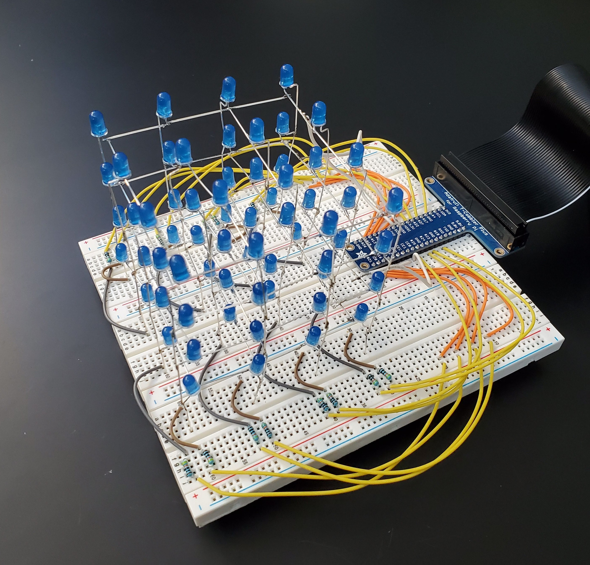

 

Our team developed a LED Cube made out of a Raspberry Pi board and LED lights. The lights were sautered together to form a 4x4 cube. For this project, I was in charge of sautering the piece together and developing the Python code that would run the series of patterns. 
